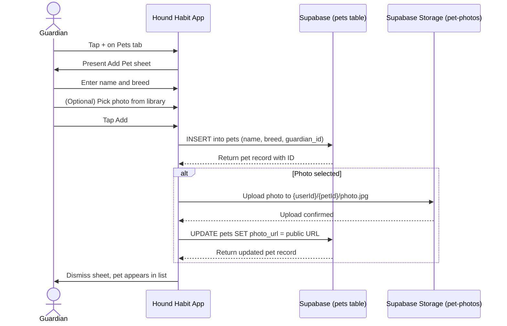
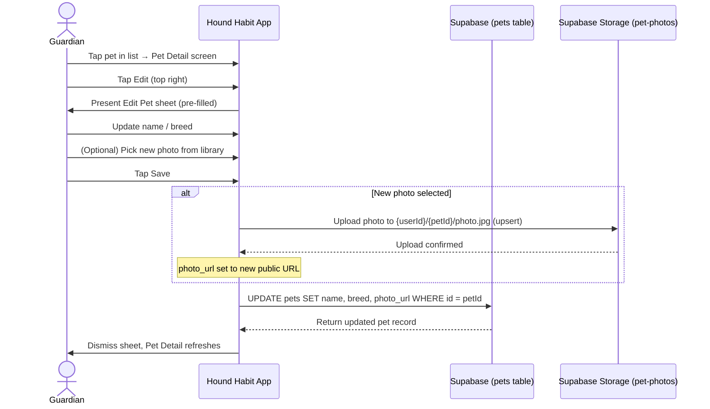
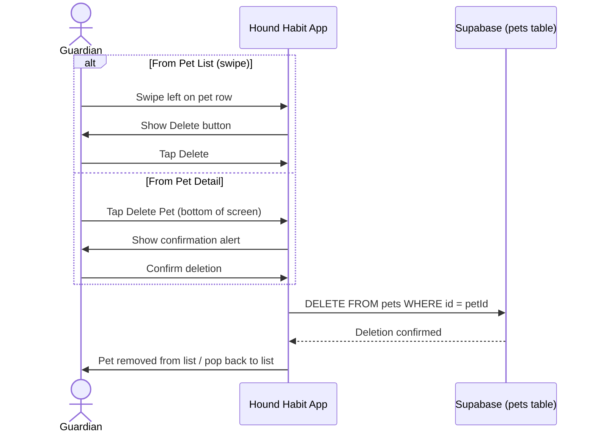

# Use Cases — Pet Management

## 1. Create Pet (with optional photo)

## 2. Edit Pet (update name, breed, or photo)

## 3. Delete Pet

## Notes

### Cache-busting `photo_url` — iOS vs. Android

Both clients write the bare public URL to `pets.photo_url`, but they handle cache-busting differently in the rendered UI:

- **iOS** sometimes persists a `?v=<timestamp>` query string baked directly into `photo_url` (e.g. row `8e59b3e5-…`'s URL ends in `?v=1776878153`).
- **Android** stores the bare URL in `photo_url` and only appends `?t=<updated_at.epochSeconds>` at render time (in `PetAvatar` / `PetRow` / `PetDetailScreen`).

Both approaches achieve the same goal: bypassing CDN caching after a re-upload. The values are functionally equivalent — but if any code path ever string-compares `photo_url`s across the two writers (e.g. dedupe logic, sync, analytics joins), strip query params first or it will mis-flag iOS-written rows as different.

